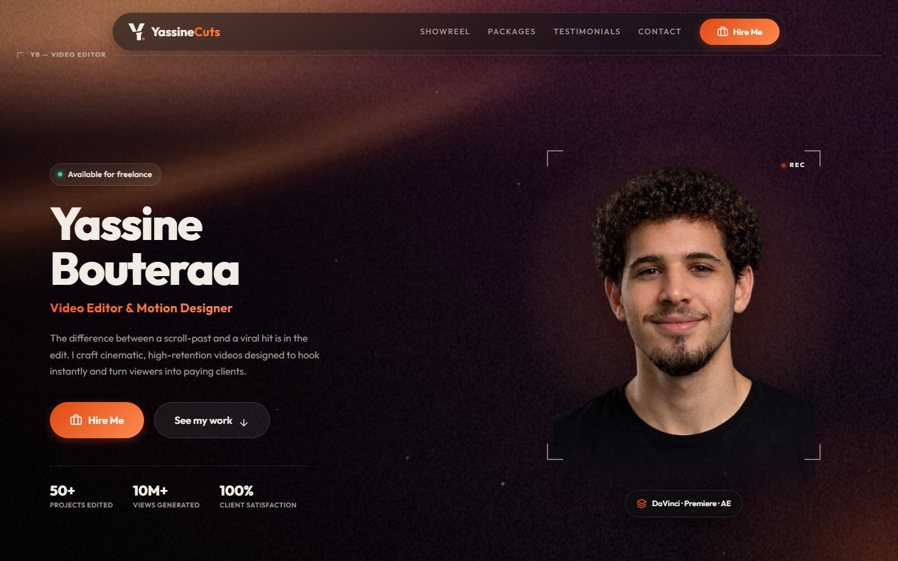
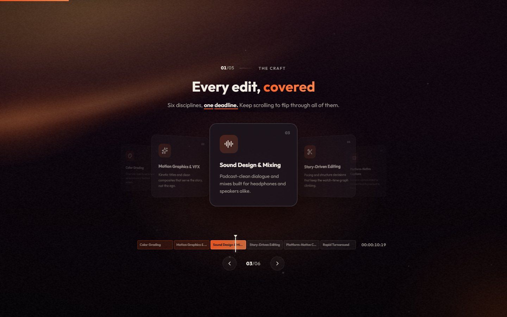
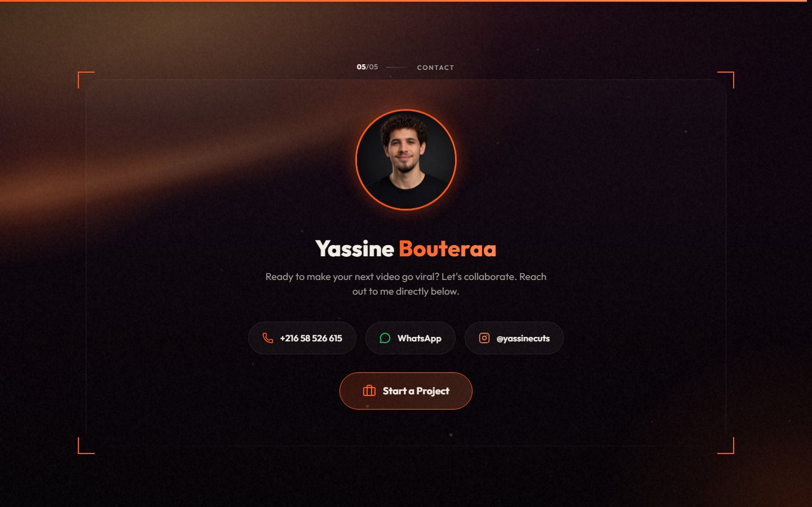

<div align="center">

# YassineCuts

**Portfolio of Yassine Bouteraa — video editor & motion designer**

[yassinecuts.live](https://yassinecuts.live) · [Instagram](https://www.instagram.com/yassinecuts)

<br />



</div>

<table>
  <tr>
    <td width="33%"></td>
    <td width="33%"></td>
    <td width="33%"></td>
  </tr>
  <tr>
    <td align="center"><sub>The Craft — scroll-driven timeline</sub></td>
    <td align="center"><sub>Showreel — 3D phone &amp; laptop</sub></td>
    <td align="center"><sub>Contact — "make the cut"</sub></td>
  </tr>
</table>

## About

A single-page portfolio built around one idea from the brand: **the cut**. The logo is a Y sliced on a diagonal, and the whole site moves like an edit.

- **Hero**: an editing playhead scrubs the name into view, and camera focus brackets lock onto the portrait.
- **Chapter titles**: huge words sliced on the logo's diagonal. The halves meet on an orange razor line, then slip apart as the next section rises over them.
- **The Craft**: the section pins in place while scrolling steps through six skills, tracked by an editing timeline with a live timecode.
- **Showreel**: vertical Shorts play on a 3D phone that flips between reels. Horizontal edits play on a 3D laptop whose lid opens on scroll. Pressing play switches to a full-screen *watching mode* that is sized so the video is never upscaled.
- **Contact**: scrolling slices the title open, and the contact card opens out of the gap like a letterbox.
- **Backdrop**: a film-stock background (amber light leak, plum-black, live grain and dust) runs behind every section.

## Brand

| Black | Orange | Cream |
| :---: | :---: | :---: |
| `#121014` | `#FF5A1F` | `#F1ECE4` |

The colours are exposed as `--brand-black`, `--brand-orange` and `--brand-cream` in `src/styles/globals.css`.

## Tech stack

| | |
| --- | --- |
| **Framework** | React 19 + Vite 7 |
| **Animation** | [Motion](https://motion.dev) (Framer Motion) + CSS 3D |
| **Data & auth** | Supabase (videos, reviews, admin session) |
| **Uploads** | Cloudinary upload widget |
| **Icons** | lucide-react |
| **Hosting** | GitHub Pages via GitHub Actions |

## Getting started

```bash
npm install
npm run dev       # http://localhost:5173
npm run build     # production build into dist/
npm run preview   # serve the production build on :4173
```

`src/config.js` holds the Supabase URL and anon key and the Cloudinary cloud name. These are public, client-side values. The data is protected by row-level security (see [Admin mode](#admin-mode)), not by keeping these keys secret.

## Deploying

Every push to `main` builds the site and publishes it through `.github/workflows/deploy.yml`.

> **One-time setup:** in the repo, go to **Settings → Pages → Build and deployment → Source** and choose **GitHub Actions**. Until then, Pages keeps serving the old files.

`public/CNAME` keeps the custom domain on `yassinecuts.live`, and `public/.nojekyll` stops GitHub from running Jekyll over the build.

## Admin mode

Click the **YassineCuts** logo in the header to open the admin sign-in. Signing in shows the *Add Video* / *Add Screenshot* buttons and the edit and delete controls on each item.

Set it up once:

1. In Supabase, go to **Authentication → Users → Add user** and enable *Auto Confirm*. That email and password are the admin login.
2. Run [`supabase/rls-policies.sql`](supabase/rls-policies.sql) in the Supabase SQL editor. This is what actually protects the data: anyone can read the portfolio and leave a written review, but only a signed-in user can edit or delete.

## Project structure

```
src/
├── App.jsx                 page composition and section order
├── config.js               public keys and shared option lists
├── styles/globals.css      design tokens and all component styles
├── lib/                    Supabase client, Cloudinary helpers, video URL parsing
├── context/                admin session, portfolio data, open modal
├── hooks/                  active nav section, media queries, watching mode
└── components/
    ├── Hero, Craft, Showreel, Testimonials, Packages, Contact
    ├── PhoneShowreel / LaptopShowreel    the 3D devices
    ├── HeroBackground                    film-stock backdrop
    ├── motion/                           the animation toolkit
    └── modals/                           video, screenshot, review, hire, login
```

### The animation toolkit

Every animation goes through a small set of primitives in `src/components/motion/`, so the whole site shares one easing curve and one sense of timing.

| Primitive | What it does |
| --- | --- |
| `Reveal` / `Stagger` | Scroll-triggered entrances |
| `TextReveal` | Headings whose words slide up out of their own line box |
| `PlayheadReveal` | A timeline playhead that wipes a headline into view |
| `SliceText` / `BigTitle` | Display text cut on the logo's diagonal, with halves that join and split on scroll |
| `ScrollWords` | Copy that lights up word by word, with a drawn underline on key words |
| `TiltCard` / `MagneticButton` | Cursor-tracking tilt and magnetic hover |
| `SectionKicker` | The `01/05 — SECTION` markers |
| `ScrollProgress` / `CursorGlow` | Page-level ambience |

`useWatchMode` (in `src/hooks/`) runs the full-screen player shared by the phone and the laptop.

## Performance & accessibility

- **Reduced motion:** `prefers-reduced-motion` is honoured throughout. Every primitive drops to a static render, the backdrop and grain freeze, and parallax and the cursor glow switch off.
- **Cheap animation:** idle animation runs on CSS and the compositor rather than JavaScript loops. Off-screen pinned sections skip rendering through `content-visibility`.
- **Lean first load:** images ship as WebP or are resized by Cloudinary. Supabase, the upload widget and the admin forms load on demand, so they never block the first paint.

## Dev tooling

Playwright scripts in `scripts/` capture screenshots and measure the site. Their output goes to `scripts/shots/`, which is git-ignored.

| Script | Purpose |
| --- | --- |
| `shoot.mjs` | Screenshot every section |
| `shoot-anim.mjs` | Frame-by-frame captures of the scroll animations |
| `shoot-readme.mjs` | Regenerate the images in this README |
| `test-phone-play.mjs` | Check that watching mode renders video 1:1 |
| `perf.mjs` / `profile.mjs` / `trace.mjs` | FPS, CPU profile and rendering-cost benchmarks |

<div align="center">
<br />
<sub>Designed and edited by <a href="https://yassinecuts.live">Yassine Bouteraa</a></sub>
</div>
